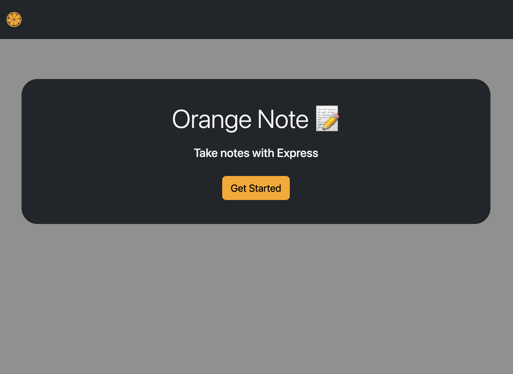
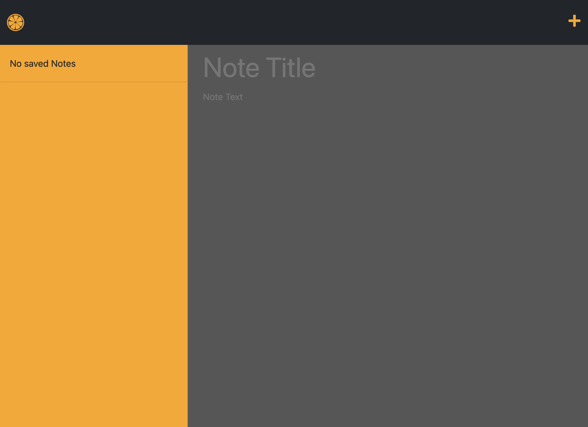

# 11-OrangeNote

## Description

Orange Note is a website that allows you to write and save notes online. You can create and manage your notes on the website and come back to them later whenever you need them. It's like having a digital notebook that you can access from any device with an internet connection.

## Table of Contents

- [Installation](#installation)
- [Usage](#usage)
- [Credits](#credits)
- [License](#license)
- [Contact](#questions)

## Installation

- [Project repo](https://github.com/shaynefw/11-OrangeNote)
- [Project deployed link](https://shaynefw.github.io/11-OrangeNote/)

Additional steps: n/a

## Usage

1. When you open the website, you'll see a page that has a big orange icon and a "Get Started" button. Click on the button to start taking notes.

2. You'll be taken to the notes page, where you'll see a blank note-taking area on the right side of the screen, and a list of any notes you've created on the left side.

3. To create a new note, click the "+" icon in the top right corner of the screen. A new, blank note will appear in the note-taking area.

4. To give your note a title, type it into the "Note Title" area.

5. Write your note in the "Note Text" area below the title.

6. When you're done, click the "save" icon (the little floppy disk icon) in the top right corner of the screen to save your note.

7. Your saved note will appear in the list on the left side of the screen. You can click on any note in the list to view or edit it.

8. If you want to create another new note, click the "+" icon again.

9. To delete a note, click on the trash can icon next to it in the list on the left side of the screen.

## Credits

prof, google, instructors, docs, classmates, tutors

## License 

This project is licensed under the MIT license. You can find more information by clicking the following badge: .

## Badges

## Features

This website provides a simple note-taking application with basic CRUD (Create, Read, Update, Delete) functionality, implemented using a JSON database and a RESTful API.

## How to Contribute

n/a

## Tests

n/a

## Questions

If you have any questions you can reach me by email at n/a.
